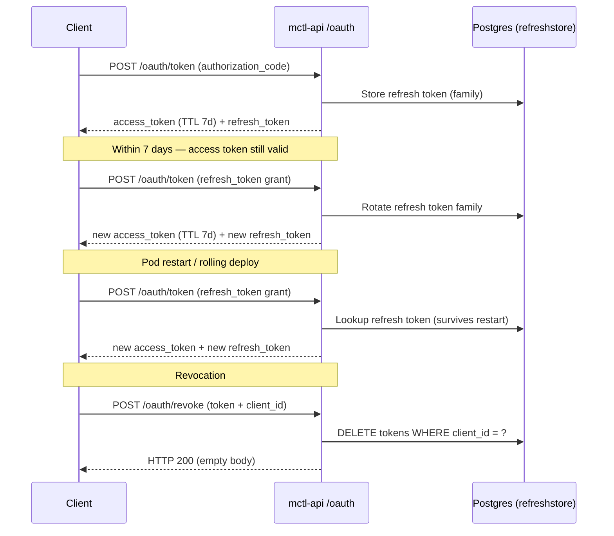

# Proposed content: auth-token-overhaul

> **Apply to:** `mctl-docs/docs/security/authentication.md` (UPDATE)
> **Source:** mctl-api@60b8034, mctl-api@2930d1b, mctl-api@5b166aa, mctl-api@b4d0c29
> **version-status:** unverified — mctl-api 4.18.4 confirmed shipped via mctl-gitops a61f047 2026-05-13; mcp__mctl__* tools unavailable.

Apply mode is UPDATE. Each section below shows a **Before** block (current assumed
state, based on inbox analysis) and an **After** block (ready to paste).
The implementer must read the current file first and locate the matching text —
exact wording of the "Before" blocks may differ slightly.

---

## Section 1: Access token lifetime

### Before

```markdown
Access tokens issued by the mctl-api OAuth server expire after **1 hour**.
Your client must refresh the token before expiry using the refresh token grant.
```

_(or equivalent language referencing a 1-hour TTL — search for "1h", "1 hour",
"one hour", "60 minutes")_

### After

```markdown
Access tokens issued by the mctl-api OAuth server expire after **7 days**.
The exact lifetime is returned in the `expires_in` field of the token response
(value: `604800` seconds). Do not hardcode the TTL in your client — always
derive expiry from `expires_in`.

> **Changed in mctl-api 4.18.4 (2026-05-10):** the access token TTL was
> extended from 1 hour to 7 days to eliminate hourly re-authentication prompts
> for MCP clients and REST API integrations.
```

---

## Section 2: Refresh token persistence

Locate the paragraph or section that describes refresh tokens. Add the following
paragraph immediately after the first description of what a refresh token is.

### After (add this paragraph)

```markdown
### Persistence and restart resilience

Refresh tokens are stored durably in **Postgres** via the `refreshstore` backend.
This means refresh tokens survive API server restarts and pod recycling — a
rolling deployment or pod eviction will not invalidate active sessions. Before
mctl-api 4.18.4, refresh tokens were held in memory only; any restart would
immediately invalidate all active refresh tokens and force every connected client
to re-authenticate.
```

---

## Section 3: Token revocation (`/revoke` endpoint)

Locate the existing revocation section (if present) and replace it, or add the
following section after the refresh token persistence section.

### After (add or replace)

```markdown
## Revoking tokens

Use the `POST /oauth/revoke` endpoint to invalidate a refresh token immediately.
The request body must be `application/x-www-form-urlencoded`.

| Parameter   | Required | Description |
|-------------|----------|-------------|
| `token`     | yes      | The refresh token to revoke. |
| `client_id` | no       | When supplied, revocation is scoped to tokens issued to this client only (RFC 7009 §2.1). Tokens for other clients with the same user are not affected. |

The server returns HTTP `200` with an empty body on success, regardless of
whether the token was found. This is intentional per RFC 7009 §2.2.

**Example — revoke a single client's tokens:**

```bash
curl -X POST https://api.mctl.ai/oauth/revoke \
  -H "Content-Type: application/x-www-form-urlencoded" \
  -d "token=<refresh_token>&client_id=<your_client_id>"
```

**Example — revoke all tokens for the token's owner (no client scoping):**

```bash
curl -X POST https://api.mctl.ai/oauth/revoke \
  -H "Content-Type: application/x-www-form-urlencoded" \
  -d "token=<refresh_token>"
```

### Retry grace window

During token rotation a race condition can occur: the client sends a refresh
request, the server rotates the token, but the response is lost in transit and
the client retries with the old token. To prevent this from causing a spurious
`invalid_grant` rejection, the server keeps a short **retry grace window** during
which the already-rotated predecessor token is still accepted and returns the new
token family. The duration of the grace window is server-configured;
<TODO: confirm exact grace window duration with author of mctl-api:5b166aa>.
```

---

## Section 4: `invalid_grant` error shape

Add the following subsection inside the error-handling or troubleshooting section
of the authentication page (or after the revocation section if no error section
exists).

### After (add this subsection)

```markdown
## Error responses

### `invalid_grant`

When a token refresh or exchange fails because the token is invalid or expired,
the server returns:

```json
{
  "error": "invalid_grant",
  "error_description": "invalid or expired token"
}
```

The `error_description` value is always the literal string
`"invalid or expired token"` regardless of the underlying cause. Internal error
details are never exposed in this field. Clients should treat any
`invalid_grant` response as a signal to discard the token and prompt the user
to re-authenticate.

> **Security note:** prior to mctl-api 4.18.4, the `error_description` field
> could contain raw internal error strings. If your client logs or surfaces this
> field, you no longer need to sanitise it — the server guarantees a fixed,
> non-leaking value.
```

---

## Optional: mermaid sequence diagram

Insert after the introductory paragraph of the page (or after the token types
overview), before the detailed sections.

```markdown
## Token lifecycle overview


```

---

## Companion update: `docs/mcp/connecting.md`

Search for any of the following strings in `docs/mcp/connecting.md`:
- `1 hour`
- `1h`
- `one hour`
- `re-connect`
- `reconnect`
- `expires every`

If found, replace the relevant sentence with:

```markdown
Access tokens issued by the mctl-api OAuth server are valid for **7 days**.
See [Authentication](/security/authentication) for full token lifecycle details.
```

If no such language is found, no change is required to `docs/mcp/connecting.md`.

---
