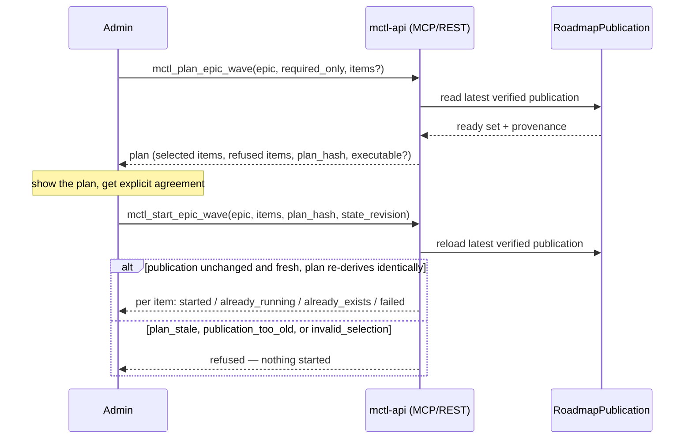

# Proposed content: mcp-roadmap-control-plane

> **Source:** mctl-api@a36ebcc, mctl-api@be13e0c, mctl-api@7ab6e32

This proposal touches five locations. Each block below states its own
**Apply to** target and mode.

---

## Block 1

> **Apply to:** `mctl-docs/docs/platform/roadmap-control-plane.md` (CREATE)
> **Source:** mctl-api@a36ebcc, mctl-api@be13e0c, mctl-api@7ab6e32

```markdown
# Roadmap Control Plane

The Roadmap Control Plane answers two questions: **what is ready to start
next on an epic**, and **can I start it now**. It is a read model plus a
governed "plan, then start" flow — `mctl-api` never decides readiness
itself.

## `mctl-api` is a pure consumer

Readiness is evaluated entirely outside `mctl-api`, by `mctlhq/.github`,
which publishes a verified **RoadmapPublication** to its `roadmap-state`
branch: a ready set (every work item's state — `complete`, `ready`,
`blocked`, or `unknown` — with typed blockers and the issue it is bound to)
and a health snapshot (overall completion of required items, plus drift
diagnostics), each tied to a manifest path and a SHA-256 digest.

`mctl-api` reads that publication, verifies it (checksums, one ready set and
one health per named manifest, the ready list agreeing with item states),
and serves it. It never labels an item ready, never runs the evaluator, and
never writes back to GitHub. An item bound to no exact issue, or one the
publication cannot verify, is `unknown` — which is **never** ready.

## Provenance on every answer

Every response — REST or MCP — carries provenance: the `roadmap-state`
commit, the evaluator and manifest revisions, the observation's
`capturedAt`, and its age in seconds. Judge the age before acting on the
answer; a five-minute-old ready set and a five-hour-old one are not the same
level of confidence.

**A `503` means "cannot say," never "nothing is ready."** If the
publication is missing or fails verification, every roadmap endpoint
refuses rather than falling back to a stale cached answer or an empty list.
Readiness is UNKNOWN in that case, not empty.

## Reading epic status

`mctl_get_epic_status` (MCP) / `GET /api/v1/roadmap/epic-status?epic=` (REST)
returns one epic's lifecycle, title, goal, manifest path and digest, its
ready set, and its health — all exactly as published. Identify the epic by
name (e.g. `lifecycle-ownership`) or by its root issue (e.g.
`mctlhq/.github#57`).

`mctl_get_ready_work_items` (MCP) / `GET /api/v1/roadmap/ready` (REST) lists
items that are ready to start now — for one named epic, or for every epic
whose lifecycle is `active` when no epic is given. `required_only` defaults
to `true`: the same safe default the wave planner uses. Several items can be
ready at once when the dependency graph allows it; **choosing between them
is a priority decision this tool does not make.**

## Planning and starting a wave

A "wave" is the set of `DevLoopWorkflow`s that would be started for an
epic's ready items. Starting one is a two-step, governed flow:



1. **`mctl_plan_epic_wave`** (read-only) selects the ready, bound,
   startable items of one epic — `required_only` by default. Pass explicit
   `items` to plan a specific subset: it is planned exactly or refused with
   `invalid_selection`, naming each id that is unknown, not ready, optional,
   unbound, not startable, or duplicated — **never silently reduced to a
   subset**. The plan carries a `plan_hash` binding the epic, the manifest
   path/digest/revision, `state_revision`, `required_only`, and the selected
   ids, refs, and workflow ids; and an `executable` flag driven by
   `ROADMAP_WAVE_MAX_AGE` (default 30 minutes).
2. **`mctl_start_epic_wave`** (admin-only) takes the plan's `epic`, `items`,
   `plan_hash`, and `state_revision` back **unchanged**. `mctl-api` reloads
   the latest verified publication and starts only if:
   - it is the exact publication the plan came from — otherwise `plan_stale`;
   - it is no older than `ROADMAP_WAVE_MAX_AGE` — otherwise `publication_too_old`;
   - re-deriving the plan produces an identical selection — otherwise `invalid_selection`.

   On any refusal, **nothing is started** — never a subset. On success, each
   item is started through the idempotent DevLoop start and reported as
   `started`, `already_running`, `already_exists` (a closed DevLoop is not
   restarted), or `failed`. Re-running the same plan starts nothing twice.
3. A wave is **refused outright** for a paused or completed epic — starting
   more work on an epic that isn't accepting it is rejected before any item
   is even considered.
4. **Starting a wave never approves anything.** Every DevLoop it starts
   still stops at its own proposal, awaiting a human approval, exactly as if
   it had been started any other way.

Cost note: each started DevLoop runs an investigator (roughly $3 each, per
the tool's own description) — plan first, review the plan, then start.

## Portal availability

`mctl_get_epic_status`, `mctl_get_ready_work_items`, `mctl_plan_epic_wave`,
and `mctl_start_epic_wave` are **disabled on the shared aggregate MCP
portal** (`mcp.mctl.ai`) as of this writing, pending an owner decision on
whether roadmap control belongs on that shared surface. They are available
today on the direct `api.mctl.ai/mcp` connector to any authenticated admin.
See [MCP Portal Tool Exposure](/mcp/tools-reference) for the general
portal-vs-direct distinction.

## Where to find it

- REST API — see [Roadmap](/api/#roadmap) on the REST API reference.
- MCP tools — see [Roadmap Control Plane](/mcp/tools-reference#roadmap-control-plane)
  on the Tools Reference.
- Worked example — see [Roadmap Control Plane](/mcp/examples#roadmap-control-plane)
  on the Examples page.
```

---

## Block 2

> **Apply to:** `mctl-docs/docs/api/index.md` (UPDATE)
> **Source:** mctl-api@a36ebcc, mctl-api@be13e0c, mctl-api@7ab6e32

Insert the following new section between the existing `## Human Input`
section and the existing `## MCP Endpoint` section.

**Before** (excerpt, end of file):

```markdown
### `POST /api/v1/human-input/{request_id}/response`

Submit an answer bound to `request_id` and `request_hash`. Only a GitHub-verified caller named in the request's `actor_refs` can answer; the service principal cannot.

## MCP Endpoint
```

**After:**

```markdown
### `POST /api/v1/human-input/{request_id}/response`

Submit an answer bound to `request_id` and `request_hash`. Only a GitHub-verified caller named in the request's `actor_refs` can answer; the service principal cannot.

---

## Roadmap

Read model and governed wave-start flow for the Roadmap Control Plane. See
[Roadmap Control Plane](/platform/roadmap-control-plane) for what an epic,
a ready work item, and a wave mean before using these endpoints. `mctl-api`
is a pure consumer of the `RoadmapPublication` `mctlhq/.github` publishes —
none of these endpoints evaluates readiness itself.

**Every endpoint below returns `503` if the current publication is missing
or fails verification.** This means "cannot say" — never treat it as "no
epics" or "nothing ready."

### `GET /api/v1/roadmap/epics`

List every epic in the current publication, with provenance.

**Response** `200`
```json
{
  "epics": [ { "name": "lifecycle-ownership", "lifecycle": "active" } ],
  "provenance": {
    "stateRevision": "<TODO: confirm exact field name/shape with author of a36ebcc>",
    "capturedAt": "2026-09-23T10:00:00Z",
    "ageSeconds": 42
  }
}
```

| Status | Description |
|--------|-------------|
| `200` | List of epics with provenance |
| `503` | No verified publication available |

### `GET /api/v1/roadmap/epic-status`

Read one epic's lifecycle, goal, ready set, and health.

**Parameters**

| Name | In | Required | Description |
|------|----|----------|-------------|
| `epic` | query | yes | Epic name (e.g. `lifecycle-ownership`) or root issue (e.g. `mctlhq/.github#57`) |

| Status | Description |
|--------|-------------|
| `200` | Epic status (lifecycle, goal, ready set, health, provenance) |
| `400` | `epic` is missing |
| `404` | Epic not found in the current publication |
| `503` | No verified publication available |

### `GET /api/v1/roadmap/ready`

List ready work items, for one epic or every active epic.

**Parameters**

| Name | In | Required | Default | Description |
|------|----|----------|---------|-------------|
| `epic` | query | no | (all active epics) | Epic name or root issue |
| `required_only` | query | no | `true` | `false` to include optional items |

| Status | Description |
|--------|-------------|
| `200` | Ready work items, grouped by epic |
| `400` | `required_only` is not a valid boolean |
| `404` | `epic` given but not found |
| `503` | No verified publication available |

### `POST /api/v1/roadmap/waves/plan`

Dry-run: select the ready, bound, startable items of one epic without
starting anything.

**Request body**
```json
{
  "epic": "enterprise-mcp",
  "required_only": true,
  "items": ["<TODO: confirm exact field name for explicit item selection with author of be13e0c>"]
}
```

**Response** `200` — the plan: selected items (each with its issue and the
exact DevLoop workflow id it would get), refused items (with a reason:
`unknown`, `not_ready`, `optional`, `unbound`, `not_startable`,
`duplicate`), `plan_hash`, `executable`, and (if not executable) a
`not_executable_reason`.

| Status | Description |
|--------|-------------|
| `200` | Plan (may be `executable: false`) |
| `400` | Invalid request body |
| `404` | Epic not found |
| `409` | Epic is paused or completed — a wave cannot be planned for it |
| `503` | No verified publication available |

### `POST /api/v1/roadmap/waves/execute`

**Admin only. Consumes write budget.** Start exactly the plan produced by
`waves/plan` — the epic, `required_only`, `items`, `plan_hash`, and
`state_revision` must be passed back unchanged.

**Request body**
```json
{
  "epic": "enterprise-mcp",
  "required_only": true,
  "items": ["<the plan's selected ids>"],
  "plan_hash": "<the plan's plan_hash>",
  "state_revision": "<the plan's provenance.state_revision>"
}
```

**Response** `200` — per item: `started`, `already_running`,
`already_exists`, or `failed`.

| Status | Description |
|--------|-------------|
| `200` | Wave executed (see per-item outcomes in the body) |
| `400` | Invalid request body |
| `403` | Caller is not an admin |
| `404` | Epic not found |
| `409` | `plan_stale` (publication changed), `invalid_selection` (plan does not re-derive identically), or epic paused/completed |
| `422` | `publication_too_old` (older than `ROADMAP_WAVE_MAX_AGE`, default 30 minutes) — `<TODO: confirm exact HTTP status code for this refusal with author of be13e0c; 409 vs 422 not verified from the commit message alone>` |
| `503` | No verified publication available |

---

## MCP Endpoint
```

---

## Block 3

> **Apply to:** `mctl-docs/docs/mcp/tools-reference.md` (UPDATE)
> **Source:** mctl-api@a36ebcc, mctl-api@be13e0c

Insert a new `## Roadmap Control Plane` section. A natural placement is
directly after the existing `## Agent Registry` section and before
`## Platform Skills` — grouping it with the other narrow-audience, largely
admin-facing sections. (If `proposals/lifecycle-ownership/` and
`proposals/lifecycle-recovery-tools/` land first, their `## Lifecycle
Ownership` section will already occupy that slot — place this section
immediately after theirs instead, so the ordering ends up: Agent Registry →
Lifecycle Ownership → Roadmap Control Plane → Platform Skills.)

**Before** (excerpt, current file, no lifecycle-ownership section yet):

```markdown
`mctl_list_agent_executions` and `mctl_list_recent_agent_runs` answer different
questions. The former reads persisted records that outlive the Argo workflow
object; the latter reflects live and recently-completed Argo state and expires
with that object's TTL.

## Platform Skills
```

**After:**

```markdown
`mctl_list_agent_executions` and `mctl_list_recent_agent_runs` answer different
questions. The former reads persisted records that outlive the Argo workflow
object; the latter reflects live and recently-completed Argo state and expires
with that object's TTL.

## Roadmap Control Plane

> **Disabled on the shared MCP portal** (`mcp.mctl.ai`), pending an owner
> decision. Available today on the direct `api.mctl.ai/mcp` connector. See
> [Roadmap Control Plane](/platform/roadmap-control-plane) for the concepts
> (epic, ready set, wave, provenance) before using these tools.

| Tool | Description | Type |
|------|-------------|------|
| `mctl_get_epic_status` | Read one epic's lifecycle, goal, ready set, and health from the published RoadmapPublication | Read |
| `mctl_get_ready_work_items` | List work items ready to start now, for one epic or every active epic | Read |
| `mctl_plan_epic_wave` | Dry-run: select the ready, startable items of an epic that a wave would start, without starting anything | Read |
| `mctl_start_epic_wave` | Start a wave planned with `mctl_plan_epic_wave` — one DevLoopWorkflow per selected item | Write |

### `mctl_get_epic_status`

**Parameters**

| Name | Required | Description |
|---|---|---|
| `epic` | yes | Epic name (e.g. `lifecycle-ownership`) or root issue (e.g. `mctlhq/.github#57`) |

Returns the epic's lifecycle, title, goal, manifest path/digest, its ready
set (every item's state — `complete`/`ready`/`blocked`/`unknown` — with
typed blockers and bound issue), its health (required-item completion and
drift diagnostics), and provenance (state/evaluator/source revisions,
`capturedAt`, age). Read-only — it never labels, approves, or starts
anything. An unbound or unobserved item is `unknown`, which is never ready.

### `mctl_get_ready_work_items`

**Parameters**

| Name | Required | Description |
|---|---|---|
| `epic` | no | Epic name or root issue. Omit for every active epic |
| `required_only` | no | `"false"` to include optional items. Defaults to `true` |

Several items may be ready at once when the dependency graph allows it;
choosing between them is a priority decision this tool does not make.

### `mctl_plan_epic_wave`

**Parameters**

| Name | Required | Description |
|---|---|---|
| `epic` | yes | Epic name or root issue |
| `required_only` | no | `false` to make optional items eligible. Defaults to `true` |
| `items` | no | Exact work-item ids to plan. Omit for every eligible item |

Only items the published ready set lists as ready are eligible. With
explicit `items`, exactly those ids are planned or the call fails with
`invalid_selection` naming every refused id — never a subset. The answer
states whether the plan is `executable` now (the publication must be no
older than the configured maximum, default 30 minutes).

### `mctl_start_epic_wave`

**Admin-only. Write, idempotent, not destructive** — it only starts
DevLoops, each of which stops at a proposal awaiting human approval.

**Parameters**

| Name | Required | Description |
|---|---|---|
| `epic` | yes | The plan's epic, as planned |
| `required_only` | no | The plan's `required_only`. Defaults to `true` |
| `items` | yes | The plan's selected ids, all of them |
| `plan_hash` | yes | The plan's `plan_hash` |
| `state_revision` | yes | The plan's `provenance.state_revision` |

`mctl-api` reloads the latest verified publication and starts only if it is
the exact publication the plan came from (`plan_stale` otherwise), no older
than the configured maximum (`publication_too_old` otherwise), and the
request re-derives an identical plan (`invalid_selection` otherwise).
Nothing starts on any refusal. Per item, the response reports `started`,
`already_running`, `already_exists`, or `failed`; re-running the same plan
starts nothing twice. Cost: each started DevLoop runs an investigator
(~$3 each).

**The flow is always:** `mctl_plan_epic_wave` → show the plan to the user →
`mctl_start_epic_wave` with that plan's `epic`, `required_only`,
`plan_hash`, `provenance.state_revision` and its selected ids, unchanged.
Starting a wave never approves a proposal.

## Platform Skills
```

---

## Block 4

> **Apply to:** `mctl-docs/docs/mcp/examples.md` (UPDATE)
> **Source:** mctl-api@a36ebcc, mctl-api@be13e0c

**Before** (excerpt, end of file):

```markdown
```
"Scale my-api to 3 replicas in staging and add the domain
api-staging.example.com to it"
```
```

**After:**

```markdown
```
"Scale my-api to 3 replicas in staging and add the domain
api-staging.example.com to it"
```

## Roadmap Control Plane

```
"What's the status of the lifecycle-ownership epic?"
"What work items are ready to start on enterprise-mcp?"
"Plan a wave for enterprise-mcp"
"That plan looks good — start it"
```

The first two calls `mctl_get_epic_status` / `mctl_get_ready_work_items`.
The third calls `mctl_plan_epic_wave(epic="enterprise-mcp")`, which returns
the selected items, any refused items with a reason, and a `plan_hash`. The
fourth calls `mctl_start_epic_wave` with that plan's `epic`, `items`,
`plan_hash`, and `state_revision` passed back unchanged — never
re-typed by hand, since even a whitespace difference would fail the
re-derivation check and refuse the whole wave with `invalid_selection`.

If the wave call instead comes back `plan_stale`, the publication changed
since the plan was made — plan again and show the new plan before
retrying. A `publication_too_old` refusal means the latest observation is
older than the platform's freshness bound — wait for the next roadmap
publication rather than retrying immediately. Neither refusal starts
anything. See [Roadmap Control Plane](/platform/roadmap-control-plane) for
the full flow and the paused/completed-epic refusal.
```

---

## Block 5

> **Apply to:** `mctl-docs/docs/platform/architecture.md` (UPDATE)
> **Source:** mctl-api@a36ebcc

**Before** (excerpt, `## Request Flow` → `### MCP Request` section header):

```markdown
## Request Flow

### MCP Request
```

**After:**

```markdown
## Request Flow

> `mctl-api` also serves the [Roadmap Control Plane](/platform/roadmap-control-plane)
> — a read model over the `RoadmapPublication` `mctlhq/.github` publishes,
> plus a governed "plan, then start" flow for kicking off a wave of
> DevLoopWorkflows against an epic's ready items. It sits inside the
> control plane shown above but is omitted from the diagram for now, since
> the diagram is component-level rather than subsystem-level (same
> treatment as the lifecycle ownership store).

### MCP Request
```

---
