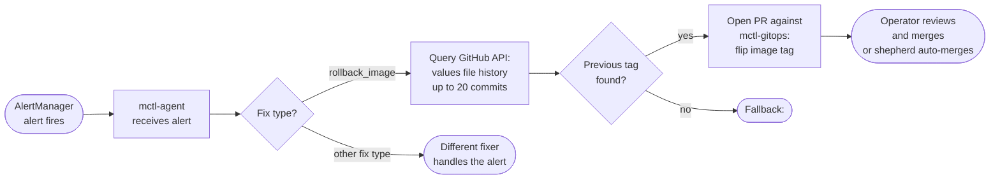

# Proposed content: mctl-agent-rollback

> **Apply to:** `mctl-docs/docs/guides/rollbacks.md` (UPDATE)
> **Source:** mctl-agent@f955a0e, mctl-agent@a8e00cf, mctl-agent@73ef4e5,
> mctl-agent@2b6d314, mctl-agent@60d364b, mctl-agent@2395f74, mctl-agent@9fb40c1,
> mctl-gitops@4f05252
> **Version-status:** unverified via MCP, confirmed in production via mctl-gitops@4f05252 (2026-05-03)

---

## Before (current end of `docs/guides/rollbacks.md`)

The page currently ends after the user-initiated rollback sections (mctl CLI and
manual GitOps PR revert). There is no automated-agent section. Append the block
below as a new top-level H2 section at the end of the file.

---

## After — new section to append

```markdown
## Agent-triggered rollback

::: tip Available since mctl-agent 1.7.0
This feature is in production as of 2026-05-03.
:::

Starting with **mctl-agent 1.7.0**, the platform can roll back a workload to its
previous image tag automatically — without any operator lookup or manual PR. When
the self-healing agent receives an alert and classifies the required fix as
`rollback_image`, it locates the last known-good tag from the GitOps history and
opens a PR to apply it.

### How it works



1. **Alert received.** AlertManager fires and delivers the alert payload to
   mctl-agent.
2. **Fix type classification.** The agent inspects the alert and determines that an
   image rollback is the appropriate fix (`rollback_image`).
3. **History walk.** The agent calls the GitHub Contents API for the GitOps values
   file that controls the affected workload. It iterates commits from newest to
   oldest, parsing the `image:` field at each revision, until it finds a tag that
   differs from the current (broken) tag or exhausts 20 commits.
4. **PR opened.** Once the previous tag is identified, the agent opens a PR against
   `mctl-gitops` that sets the image tag back to that value.
5. **Human review.** Operators receive a standard GitHub PR notification. If the
   shepherd auto-merge policy is active for the repository, the PR may merge
   automatically. `<TODO: confirm auto-merge policy details with author of f955a0e>`

### Supported `image:` YAML shapes

The YAML parser in mctl-agent 1.7.0 handles all of the following patterns in a
GitOps values file:

```yaml
# Top-level tag
image: "registry.example.com/myapp:v1.2.3"

# Indented block (e.g. inside a chart sub-key)
myapp:
  image: "registry.example.com/myapp:v1.2.3"

# Inline comment on the image line
image: "registry.example.com/myapp:v1.2.3"  # pinned release

# Chart-level scoped lookup (agent uses chart name to find the correct key)
frontend:
  image: "registry.example.com/frontend:v2.0.0"
backend:
  image: "registry.example.com/backend:v1.5.1"
```

### What operators see

When the agent opens a rollback PR you will receive a standard GitHub pull-request
notification. The PR description includes:

- The affected workload and namespace.
- The current (broken) image tag.
- The proposed (previous) image tag and the GitOps commit SHA it was taken from.

Review the diff, confirm the previous tag is the correct rollback target, and merge.
If your tenant has the shepherd auto-merge policy enabled, the PR may merge without
manual action — check your tenant's `mctl-gitops` repository settings to confirm.
`<TODO: confirm auto-merge policy details with author of f955a0e>`

### Limitations

- The agent searches up to **20 commits** of the values file history. If the image
  tag has not changed in the last 20 commits, the rollback cannot be resolved
  automatically and the agent falls back to
  `<TODO: confirm fallback behaviour with author of f955a0e>`.
- The `rollback_image` fix type is triggered by the alert classification logic.
  If the alert does not match the rollback pattern, the agent will use a different
  fixer or escalate.
- The feature requires that the GitOps values file is accessible to the agent via
  the GitHub API with its configured credentials.
```

---

## Cross-reference patch for `docs/platform/components.md`

> **Apply to:** `mctl-docs/docs/platform/components.md` (UPDATE — one sentence addition)

Locate the mctl-agent capability block in `docs/platform/components.md` (the
paragraph or bullet list that describes what mctl-agent can fix). After the last
item in that list (or at the end of the agent description paragraph), add:

```markdown
For the automated image rollback flow, see
[Agent-triggered rollback](/guides/rollbacks#agent-triggered-rollback).
```
