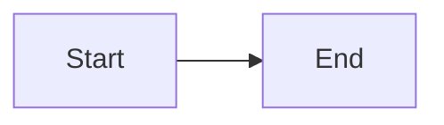
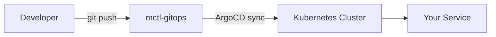
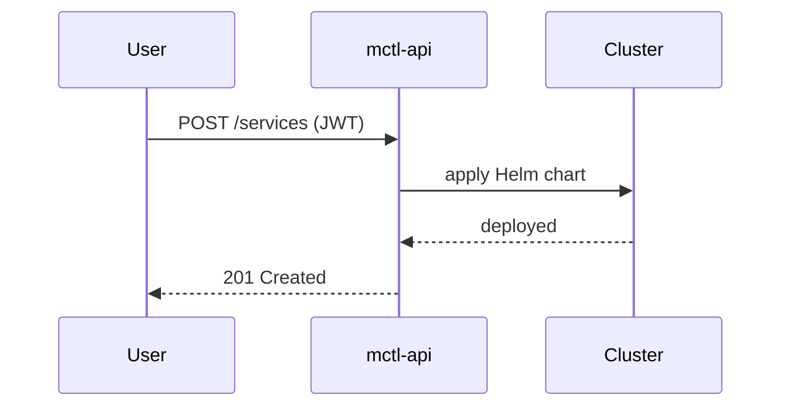

# Proposed content: mermaid-diagrams-guide

> **Apply to:** `mctl-docs/docs/reference/diagrams.md` — CREATE
> **Source:** mermaid-js/mermaid@11.14.0 (2025-04-01), mermaid-js/mermaid@11.13.0 (2025-03-09)
> **version-status: unverified** — confirm exact mermaid version in production (`package.json`)
> before publishing beta diagram examples.

---

```markdown
---
title: Diagram Types
description: Mermaid diagram types available in mctl docs, with examples and usage guidance.
---

# Diagram Types

mctl docs uses [Mermaid](https://mermaid.js.org/) (v11.x) for all diagrams.
Any `.md` file can include a mermaid block using the standard VitePress/mermaid syntax:

````

````

> **Version note:** This page reflects mermaid **11.14.0**. Some diagram types are in beta —
> they may have rendering quirks or API changes in future minor versions.

---

## Supported diagram types

| Type | Stability | Best for |
|------|-----------|----------|
| Flowchart | ✅ Stable | Process flows, decision trees |
| Sequence | ✅ Stable | API call sequences, auth flows |
| Architecture | ✅ Stable | System component layouts |
| ER diagram | ✅ Stable | Data model relationships |
| State diagram | ✅ Stable | Service lifecycle, status machines |
| Class diagram | ✅ Stable | Object/API schema relationships |
| Timeline | ✅ Stable | Chronological roadmaps |
| gitGraph | ✅ Stable | Git branch flows |
| Pie chart | ✅ Stable | Proportions, quota usage |
| TreeView | ✅ Stable | Hierarchical structures (new in 11.14) |
| Wardley Map | ⚠️ Beta | Strategic component evolution |
| Venn diagram | ⚠️ Beta | Set overlaps, feature comparison |
| Ishikawa (fishbone) | ⚠️ Beta | Root cause analysis |
| Mindmap | ✅ Stable | Concept maps |

---

## Examples

### Flowchart



### Sequence diagram



### Architecture diagram


### Wardley Map (beta)

::: warning Beta feature
Wardley Maps are in beta as of mermaid 11.14. Rendering may change in future versions.
:::

```mermaid
wardley
    title mctl Platform Evolution
    [mctl-api] [0.8, 0.6]
    [mctl-portal] [0.6, 0.5]
    [Kubernetes] [0.9, 0.2]
    [mctl-api] --> [Kubernetes]
    [mctl-portal] --> [mctl-api]
```

### Venn diagram (beta)

::: warning Beta feature
Venn diagrams are in beta as of mermaid 11.13.
:::

```mermaid
venn
    title Tenant access overlap
    A[admins]
    B[labs]
    AB[shared namespaces]
```

### Ishikawa / Fishbone (beta)

::: warning Beta feature
Ishikawa diagrams are in beta as of mermaid 11.13.
:::

```mermaid
---
config:
  theme: default
---
%%{init: { 'logLevel': 'debug', 'theme': 'default' } }%%
  isikawa
    root((Service down))
    cause1[Network]
      c1a[DNS timeout]
      c1b[Load balancer config]
    cause2[Config]
      c2a[Wrong env var]
      c2b[Missing secret]
    cause3[Code]
      c3a[Memory leak]
```

---

## htmlLabels deprecation (mermaid 11.13+)

::: warning Deprecated
The `htmlLabels` option for flowchart diagrams is **deprecated** as of mermaid 11.13.
:::

If you have existing diagrams using `%%{init: {"flowchart": {"htmlLabels": true}}}%%`,
remove the `htmlLabels` config block — it is now the default behaviour and the explicit setting
is no longer honoured.

**Before (deprecated):**
```
%%{init: {"flowchart": {"htmlLabels": false}}}%%
flowchart LR
    A --> B
```

**After (correct):**
```
flowchart LR
    A --> B
```

---

## Neo look (mermaid 11.14+)

mermaid 11.14 introduced "Neo look" — a refreshed default visual style applied to:
state diagrams, sequence diagrams, ER diagrams, requirement diagrams, mindmaps, flowcharts,
class diagrams, timelines, and gitGraph.

No action required: Neo look is applied automatically. If you have custom theme overrides in
`docs/.vitepress/config.ts`, verify they render as expected after a mermaid bump.

---

## Best practices

- **Use mermaid for structural relationships.** If a sentence does the job, skip the diagram.
- **Keep diagrams small.** Large flowcharts become hard to read in mobile viewports.
- **Label all nodes and edges** clearly — mctl tenants (admins/labs/ovk) should be named literally.
- **Don't embed secrets or internal IP addresses** in diagram labels.
- **For beta types**, add a `::: warning Beta` callout so readers know the diagram syntax may change.
```

---
