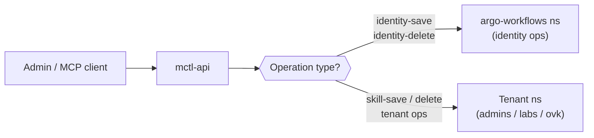

# Proposed content: openclaw-api-routing

> **Apply to:** `mctl-docs/docs/platform/openclaw.md` (UPDATE)
> **Source:** mctl-api@e4f104d, mctl-api@92fbf9e, mctl-api@edba139

---

**Before** (existing section structure in `docs/platform/openclaw.md`):

The page currently ends after the channels / tenant configuration section with no mention
of API paths or namespace routing. Insert the following subsection immediately after the
existing configuration section, before any footer or see-also links.

---

**After** — insert this block:

---

## API paths and namespace routing

> _Applies as of mctl-api 4.15.0 — commits `e4f104d`, `92fbf9e`, `edba139`.
> version-status: unverified._

### Dedicated endpoints for skill and identity operations

OpenClaw skill and identity operations are **not** accepted on the generic
`POST /api/v1/operations/:name/execute` endpoint. Calling that path with an OpenClaw
operation name returns `400 Bad Request`:

```
POST /api/v1/operations/openclaw-skill-save/execute
→ 400: "operation is OpenClaw-only; use the dedicated API path"
```

Use the dedicated paths instead (full reference in [REST API](/api/)):

| Operation | Endpoint category |
|---|---|
| `openclaw-skill-save` | `/api/v1/openclaw/…` |
| `openclaw-skill-delete` | `/api/v1/openclaw/…` |
| `openclaw-identity-save` | `/api/v1/openclaw/…` |
| `openclaw-identity-delete` | `/api/v1/openclaw/…` |

> `<TODO: confirm exact dedicated endpoint paths with author of mctl-api:92fbf9e>`

### Namespace routing for identity workflows

Identity operation pods (`openclaw-identity-save`, `openclaw-identity-delete`) run in the
**`argo-workflows`** Kubernetes namespace, not in the calling tenant's namespace. This is
intentional: identity management is a platform-scoped concern shared across all tenants.



When monitoring Argo Workflows, look for identity pods in the `argo-workflows` namespace
regardless of which tenant initiated the call.

### Identity listing allowlist

The identity listing endpoint is restricted to a fixed allowlist. Callers outside the
allowlist receive an error. If you need listing access, contact the platform team to be
added to the allowlist.

> `<TODO: confirm the allowlist mechanism (env var / config) with author of mctl-api:edba139>`

---
