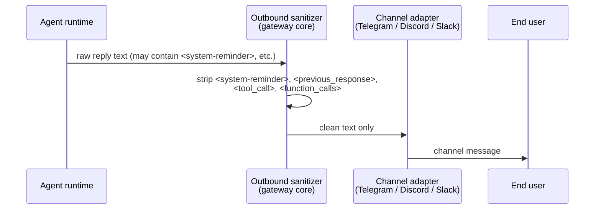

# Proposed content: openclaw-outbound-sanitization

> **Apply to:** `mctl-docs/docs/platform/openclaw.md` (UPDATE)
> **Source:** `mctl-openclaw@c2d31a5`, `mctl-openclaw@c5c08c0`, `mctl-openclaw@98f5fd1`
> **version-status: unverified** — confirm commits are in the live mctl-openclaw deployment before merging.

---

## Diff: add "Security" section to `docs/platform/openclaw.md`

Append the following section at the end of the page (before any existing footnotes or
closing links), or after the "Tenant isolation" section if one exists.

**Before** (current end of page):

```markdown
<!-- end of existing openclaw.md content -->
```

**After** (add the entire block below):

```markdown
## Security

### Outbound content sanitization

OpenClaw strips a fixed set of internal XML tags from every outbound message before it
reaches a channel adapter (Telegram, Discord, Slack, BlueBubbles). This stripping happens
at the **final delivery boundary** in the core gateway layer and is not configurable per
channel or per tenant.

Tags stripped as of commit `c2d31a5` (2026-04-28):

| Tag | Purpose |
|---|---|
| `<system-reminder>` | Harness-injected system context visible only to the model |
| `<previous_response>` | Prior model turn scaffolding reused for context injection |
| `<tool_call>` / `<function_calls>` | Internal tool-invocation XML not intended for users |

> **Guarantee:** end users on all tenants (`admins`, `labs`, `ovk`) will never see raw
> internal scaffolding in a channel reply, regardless of which model or plugin produced it.

**Delivery path (simplified):**



### Inter-session prompt isolation

When the agent runtime routes a message from one session to another (for example, via
`sessions_send` or an A2A relay), the receiving session's prompt is wrapped in an
**inter-session envelope** so the model can distinguish routed agent-to-agent content
from live user input:

```
[Inter-session message from <sender-session-id>; isUser=false]
<content of routed message>
[/Inter-session message]
```

The `isUser=false` flag is propagated through the harness so that the receiving model
does not treat the routed content as a new human turn. This prevents cross-session prompt
injection where an agent could craft a message that looks like a user instruction to a
downstream agent.

> **See also:** [Authentication & authorization](/security/authentication) for credential
> isolation between tenants.
```

---

### Cross-link to add in `docs/security/authentication.md`

Find the end of the main content and add:

```markdown
> **Related:** [OpenClaw outbound content sanitization](/platform/openclaw#security) —
> how the AI gateway strips internal scaffolding before channel delivery.
```
