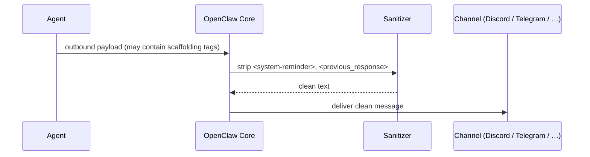

# Proposed content: openclaw-outbound-security

> **Apply to:** `mctl-docs/docs/platform/openclaw.md` (UPDATE)
> **Source:** mctl-openclaw@c2d31a5, mctl-openclaw@c5c08c0
> **Version-status:** unverified — confirm against production mctl-openclaw before merging.

---

## Before (approximate current state of the Security section — absent)

```md
<!-- No Security section exists in docs/platform/openclaw.md today. -->
```

## After — insert the following section after the channels/integration overview

---

```md
## Security

### Outbound message sanitization

Before any message is delivered to an end-user channel (Discord, Telegram, Google Chat,
BlueBubbles, or any other registered channel), OpenClaw strips internal runtime scaffolding
at the final delivery boundary. The following XML constructs are removed:

- `<system-reminder>…</system-reminder>`
- `<previous_response>…</previous_response>`

This sanitization is applied at the core delivery layer — it is not a per-channel option and
cannot be disabled by a plugin hook. It ensures that degraded harness replies or plugin-injected
scaffolding can never reach end users as raw markup.



> **Source:** commit `c2d31a5` (mctl-openclaw, 2026-04-28).

### Inter-session prompt isolation

When one agent sends a message to another via `sessions_send` or an agent-to-agent (A2A)
reply, the receiving agent's prompt is wrapped with an inter-session envelope marker at the
time of the model call:

```
[Inter-session message from <source-session> via <channel> (isUser=false)]
<routed message text>
```

The `isUser=false` flag tells the receiving model that this input was routed from another
agent, not typed by a live end user. The transcript still records `role: "user"` for
provider compatibility, but both the inline text and provenance metadata mark the turn
as inter-session data.

**Practical implication for mctl tenant developers:** if you build multi-agent flows where
Agent A routes tasks to Agent B, Agent B's model context will clearly distinguish A's
instructions from actual user input. You do not need to add your own sentinel markers.

> **Source:** commit `c5c08c0` (mctl-openclaw, 2026-04-28). See also OpenClaw's own
> [session-tool concept guide](https://docs.openclaw.ai/concepts/session-tool) for the
> full A2A protocol.

For authentication and authorization of channel connections, see
[Authentication](/security/authentication).
```

---
