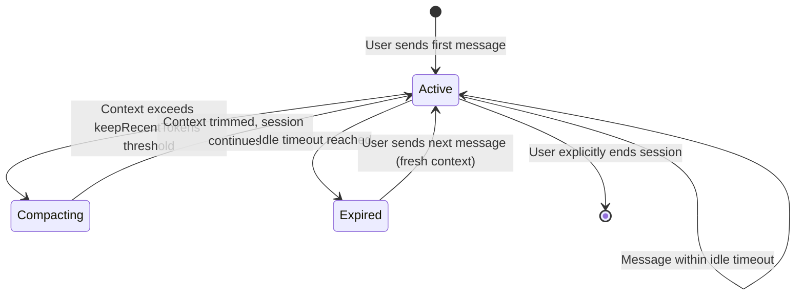

# Proposed content: openclaw-session-observability

> **Apply to:** `mctl-docs/docs/platform/openclaw.md` (UPDATE)
> **Source:** mctl-gitops@17a4743, mctl-gitops@3e792eb, mctl-openclaw@4c46cf1, mctl-openclaw@b23903e
> **version-status:** unverified — mctl-openclaw 2026.5.14-beta.1 confirmed shipped via mctl-gitops 4272f71 2026-05-13; mcp__mctl__* tools unavailable.

Apply mode is UPDATE. The implementer must read the current
`docs/platform/openclaw.md` first and append (or insert at a logical point)
the three sections below. Do not replace existing content unless it directly
contradicts the new information.

---

## Section 1: Session management

Append after the existing channel or routing content.

```markdown
## Session management

> Available from mctl-openclaw 2026.5.2-mctl.1 (shipped to `ovk` and `labs` via
> mctl-gitops commit `17a4743`, 2026-05-10).

### Context compaction

For long-running Telegram sessions, OpenClaw automatically compacts the
conversation context once it grows beyond a configurable threshold. Compaction
keeps a rolling window of the most recent tokens (`keepRecentTokens`) and
discards older history. This reduces latency and LLM token costs for extended
conversations without requiring the user to manually start a new session.

The `keepRecentTokens` value is set per-tenant in the OpenClaw deployment
configuration (managed via mctl-gitops). Contact your platform administrator to
review or adjust this value for your tenant.

<TODO: confirm the default value of `keepRecentTokens` and the compaction trigger
threshold (total context size at which compaction fires) with the author of
mctl-gitops:17a4743>

### Session idle timeouts

Telegram sessions that are left idle for longer than the configured idle timeout
are expired automatically. On the next message after expiry, the session starts
fresh with an empty context.

<TODO: confirm the default idle timeout duration with the author of
mctl-gitops:17a4743>

The idle timeout is configured per-tenant in mctl-gitops. If you need to adjust
it for your tenant, open a request via the platform GitOps workflow (see
[GitOps Workflows](/guides/gitops-workflows)).
```

---

## Section 2: Fallback model

Append after the session management section.

```markdown
## Fallback model

When the primary LLM for a tenant is unavailable or rate-limited, OpenClaw
routes requests to the configured fallback model.

| Tenant | Fallback model (as of 2026-05-10) |
|--------|-----------------------------------|
| `ovk`  | Claude Haiku                      |
| `labs` | Claude Haiku                      |
| `admins` | <TODO: confirm with platform admin> |

> **Changed in mctl-gitops commit `3e792eb` (2026-05-10):** The fallback model
> for `ovk` and `labs` was switched to Claude Haiku. Responses served via the
> fallback model may have different quality and cost characteristics compared to
> the primary model.

The fallback model is configured per-tenant in mctl-gitops and can be changed
by a platform administrator. The current configuration is the authoritative
source of truth — this table reflects the state at the time of documentation.
```

---

## Section 3: Observability

Append after the fallback model section.

```markdown
## Observability

> Available from mctl-openclaw 2026.5.14-beta.1 (shipped to `labs` via
> mctl-gitops; enabled alongside Grafana dashboards on 2026-05-13).
>
> **Beta:** The `/metrics` endpoint is available in production for `labs` and
> `ovk` tenants. Treat counter names as stable within the 2026.5.x release
> series; names may change between major versions.

### Prometheus `/metrics` endpoint

The OpenClaw gateway exposes a Prometheus-compatible `/metrics` endpoint.

**Endpoint URL:**

```
<TODO: confirm exact URL format with author of mctl-openclaw:4c46cf1 — likely
https://<tenant>-openclaw.mctl.ai/metrics or similar>
```

**Example Prometheus scrape config:**

```yaml
scrape_configs:
  - job_name: openclaw-labs
    static_configs:
      - targets:
          - <TODO: confirm host:port with author of mctl-openclaw:4c46cf1>
    metrics_path: /metrics
```

### `openclaw_llm_*` counter family

All LLM usage metrics are grouped under the `openclaw_llm_` prefix and carry
a `provider` label.

| Label `provider` value | Description |
|------------------------|-------------|
| `anthropic`            | Requests routed to the Anthropic API (Claude models) |
| `codex`                | Requests routed to the OpenAI / Codex API |

<TODO: confirm the full set of counter names (e.g. `openclaw_llm_tokens_total`,
`openclaw_llm_requests_total`, `openclaw_llm_errors_total`) with the author of
mctl-openclaw:b23903e — the metric file `src/logging/llm-metrics.ts` defines
these but the exact exported names must be verified>

**Example PromQL — per-provider token usage rate (5-minute window):**

```promql
rate(openclaw_llm_tokens_total[5m]) by (provider)
```

**Example PromQL — request error rate by provider:**

```promql
rate(openclaw_llm_errors_total[5m]) by (provider)
```
```

---

## Optional: mermaid session lifecycle diagram

Insert at the beginning of the "Session management" section, after its opening
paragraph.

```markdown

```

---
