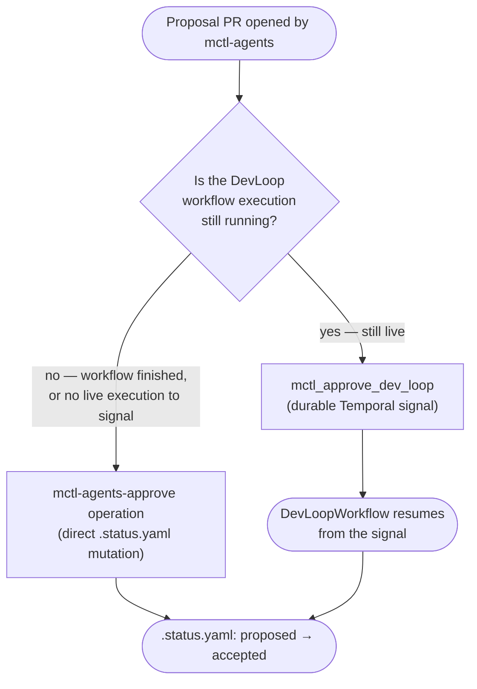

# Proposed content: platform-operations-approval-flow

> **Source:** `mctl-api@1c6a746`, `mctl-api@20db091`, `mctl-api@3dee7e9`
> **Version-status:** confirmed live in production (mctl-api 4.37.0) via
> `mctl_list_operations` showing `mctl-agents-approve` / `mctl-agents-reconcile` today,
> and via mctl-gitops `bump admins/mctl-api to 4.37.0` (`3441a91`). See the 2026-09-05
> mctl-docs inbox for the underlying scan.

This proposal touches three files. Apply each section below to its target file.

---

## Section 1 — new page

> **Apply to:** `mctl-docs/docs/reference/operations.md` (CREATE)
> **Source:** `mctl-api@1c6a746`, `mctl-api@20db091`

```markdown
---
title: Platform Operations
description: Reference for the mctl platform operations catalog and how it differs from individual MCP tools.
---

# Platform Operations

A **platform operation** is a named, audited admin-level action on the mctl platform.
Operations are distinct from individual [MCP tools](/mcp/tools-reference): some MCP
tools trigger a specific operation directly (for example, an MCP tool may wrap the
`mctl-agents-approve` operation under the hood), while others are lower-level actions
with no dedicated operation entry. Use the operations catalog when you want a canonical,
discoverable list of admin actions independent of which client or tool triggered them.

## Discovering operations

Use `mctl_list_operations` to list every operation currently registered on the platform:

```
mctl_list_operations()
# → { "operations": [ "mctl-agents-approve", "mctl-agents-reconcile", ... ] }
```

<TODO: confirm with author of 1c6a746 — exact response shape of mctl_list_operations,
including whether it returns bare names, or objects with metadata (description, risk
level, required scope).>

Use `mctl_get_operation` to inspect a single operation by name:

```
mctl_get_operation(name="mctl-agents-approve")
# → <TODO: confirm with author of 1c6a746 — exact response shape, e.g. description,
#    parameters, required permissions, audit-log behavior>
```

## Operations catalog

| Operation | Purpose | Effect |
|---|---|---|
| `mctl-agents-approve` | Approve an `mctl-agents` proposal | Flips the proposal's `.status.yaml` in the GitOps repository from `proposed` to `accepted` |
| `mctl-agents-reconcile` | Reconcile GitHub PR state onto a proposal | Updates `.status.yaml` to `merged`, `closed`, or `needs-triage` based on the linked GitHub PR's state, without invoking a model |

> See also: [MCP Tools Reference](/mcp/tools-reference) for the pipeline-control MCP
> tools (`mctl_trigger_agents_run`, `mctl_trigger_implementer`, etc.) that operate
> alongside this catalog, and
> [Approving agent proposals](/guides/gitops-workflows#approving-agent-proposals) for
> how `mctl-agents-approve` compares to the durable DevLoop signal path.

### `mctl-agents-approve`

Approves an `mctl-agents` proposal by directly mutating its `.status.yaml` file in the
`mctl-gitops` repository from `proposed` to `accepted`. This is a first-class platform
operation — it is tracked, audited, and does not require a manual GitOps commit by an
admin.

**Parameters:** <TODO: confirm with author of 1c6a746 — likely a proposal identifier
(service + slug) and the requesting admin's identity>

**Effect:** `.status.yaml` for the target proposal moves from `proposed` to `accepted`.
Once accepted, the implementer pipeline (`mctl_trigger_implementer`) can pick up the
proposal and open an implementation PR.

::: tip
This operation does **not** signal any running DevLoop workflow execution. If you are
approving a proposal whose DevLoop workflow is still in progress, consider the durable
signal path instead — see
[Approving agent proposals](/guides/gitops-workflows#approving-agent-proposals).
:::

### `mctl-agents-reconcile`

Reconciles a proposal's `.status.yaml` against the current state of its linked GitHub
pull request — without invoking a model. This closes the loop after a human merges or
closes a proposal's implementation PR outside of the platform's own tooling.

**Parameters:** <TODO: confirm with author of 20db091 — likely a proposal identifier
and/or PR URL>

**Effect:** `.status.yaml` moves to one of `merged`, `closed`, or `needs-triage`
depending on the observed GitHub PR state.

## Version notes

Both `mctl-agents-approve` and `mctl-agents-reconcile` are live in production as of
mctl-api 4.37.0. An in-flight pair of MCP tool wrappers around these two operations
(`mctl_trigger_reconcile`, `mctl_trigger_approve`) had not shipped as of this writing —
this page will be updated with the corresponding MCP call examples once they are
released.
```

---

## Section 2 — gitops-workflows.md subsection (diff)

> **Apply to:** `mctl-docs/docs/guides/gitops-workflows.md` (UPDATE)
> **Source:** `mctl-api@3dee7e9`
> **Mode:** insert the new "Approving agent proposals" subsection immediately after the
> existing section that describes the `mctl-agents` proposal/PR lifecycle (or, if no
> such section currently exists under a different heading, add it as a new H2 near the
> end of the page, before any closing "See also" block).

### Before (illustrative — exact surrounding heading may differ)

```markdown
## Repository Structure

The `mctl-gitops` repository is organized by tenant:
...

## CI/CD Integration

When you push a tag to a service repository:
...
```

### After (insert the new section between the two above, or at the end of the page)

```markdown
## Repository Structure

The `mctl-gitops` repository is organized by tenant:
...

## Approving agent proposals

The `mctl-agents` pipeline opens proposal pull requests for platform documentation and
config changes. Once a proposal exists, there are **two distinct ways** to approve it —
they are not interchangeable, and using the wrong one can leave workflow state
inconsistent.



### Durable DevLoop signal path — `mctl_approve_dev_loop`

Use this when the proposal's `DevLoopWorkflow` execution is **still running**. This
tool sends a durable Temporal signal directly to the live workflow execution, letting
it resume past the approval gate without you touching any GitOps file. Because the
signal is delivered through Temporal, it survives worker restarts and is the
recommended path whenever the workflow is still alive.

```
mctl_approve_dev_loop(<TODO: confirm with author of 3dee7e9 — exact parameter names,
likely a workflow ID or run ID>)
```

::: warning Do not confuse this with the `mctl-agents-approve` operation
The tool description for `mctl_approve_dev_loop` explicitly warns that this durable
signal path is distinct from directly mutating `.status.yaml` via the
`mctl-agents-approve` operation. Signaling a workflow that has already completed has
no effect on `.status.yaml`; conversely, mutating `.status.yaml` directly does **not**
notify a still-running workflow execution.
:::

### Direct GitOps-file path — `mctl-agents-approve` operation

Use this when the DevLoop workflow execution has already **finished** (or there is no
live execution to signal at all). This is the operation documented in the
[Platform Operations](/reference/operations#mctl-agents-approve) catalog: it mutates
the proposal's `.status.yaml` from `proposed` to `accepted` directly in the
`mctl-gitops` repository.

### Which one should I use?

| Situation | Use |
|---|---|
| DevLoop workflow execution is still running | `mctl_approve_dev_loop` (durable signal) |
| DevLoop workflow has already completed, or no execution to signal | `mctl-agents-approve` operation (direct `.status.yaml` mutation) |
| You need to sync `.status.yaml` after a PR was merged/closed manually on GitHub | `mctl-agents-reconcile` operation — see [Platform Operations](/reference/operations#mctl-agents-reconcile) |

## CI/CD Integration

When you push a tag to a service repository:
...
```
```

---

## Section 3 — tools-reference.md cross-link (diff)

> **Apply to:** `mctl-docs/docs/mcp/tools-reference.md` (UPDATE)
> **Source:** `mctl-api@1c6a746`, `mctl-api@20db091`, `mctl-api@3dee7e9`
> **Mode:** add a one-line cross-link in (or immediately after) the admin-tools /
> mctl-agents pipeline-controls area of the page.

### Before

```markdown
## mctl-agents pipeline controls

> **Admin-only.** All tools in this section require membership in the `admins` group.
> Calls from non-admin users return `403 Forbidden`.
```

### After

```markdown
## mctl-agents pipeline controls

> **Admin-only.** All tools in this section require membership in the `admins` group.
> Calls from non-admin users return `403 Forbidden`.
>
> For the full catalog of admin-level platform operations (including
> `mctl-agents-approve` and `mctl-agents-reconcile`) and how they differ from the MCP
> tools listed here, see [Platform Operations](/reference/operations). For the two
> approval paths for `mctl-agents` proposals specifically, see
> [Approving agent proposals](/guides/gitops-workflows#approving-agent-proposals).
```

---

> **Note for implementer:** if the "mctl-agents pipeline controls" section from the
> `mcp-agents-tools` proposal has not been applied yet, insert this cross-link note in
> whatever section of `docs/mcp/tools-reference.md` currently discusses admin-only /
> mctl-agents-related tools, or as a standalone callout near the top of the page if no
> such section exists yet.
