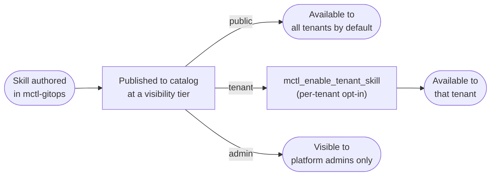

# Proposed content: platform-skills-catalog

> **Source:** `mctl-gitops@fc35b55`, `mctl-gitops@cae7549`, `mctl-gitops@6d0c3d0`
> **Version-status:** confirmed live via `mctl_list_platform_skills` (2026-09-05 inbox
> scan) — "review-watch" (admin) and "archify-diagrams" (public) both present in the
> catalog today.

This proposal touches two files. Apply each section below to its target file.

---

## Section 1 — new page

> **Apply to:** `mctl-docs/docs/platform/skills.md` (CREATE)
> **Source:** `mctl-gitops@fc35b55`, `mctl-gitops@cae7549`, `mctl-gitops@6d0c3d0`

```markdown
---
title: Platform Skills
description: What a platform skill is, the public/tenant/admin visibility tiers, and how to enable or disable a skill for your tenant.
---

# Platform Skills

A **platform skill** is a reusable capability published to the mctl platform's skills
catalog. Skills are distinct from [MCP tools](/mcp/tools-reference) (the callable
interface a client uses) and from [platform operations](/reference/operations)
(named, audited admin-level actions): a skill is a capability the platform publishes
once and then makes available — at a given visibility tier — to some or all tenants.

## Visibility tiers

Every platform skill is published at one of three visibility tiers:

| Tier | Who can see / use it | Example |
|---|---|---|
| `public` | Every tenant, by default | `archify-diagrams` |
| `tenant` | A tenant, once explicitly enabled for it | <TODO: confirm with author of fc35b55 — is this opt-in per-tenant on request, or restricted to specific named tenants by the platform team?> |
| `admin` | Platform admins only — not exposed to tenant owners | `review-watch` |



## Discovering skills

List every skill visible to the caller with `mctl_list_platform_skills`:

```
mctl_list_platform_skills()
# → { "skills": [
#      { "name": "archify-diagrams", "visibility": "public", ... },
#      { "name": "review-watch", "visibility": "admin", ... }
#    ] }
```

<TODO: confirm with author of fc35b55 — exact response shape (field names beyond
`name`/`visibility`, e.g. description, version, `lastModified`).>

Read the full definition of a specific skill with `mctl_read_platform_skill`:

```
mctl_read_platform_skill(name="archify-diagrams")
# → <TODO: confirm with author of cae7549 — exact response shape>
```

## Enabling or disabling a skill for your tenant

`tenant`-tier skills must be explicitly enabled before your tenant can use them.
`public`-tier skills are available without any action. `admin`-tier skills cannot be
enabled by tenant owners at all.

```
mctl_enable_tenant_skill(<TODO: confirm with author of 6d0c3d0 — exact parameter
names, e.g. tenant identifier, skill name>)
```

```
mctl_disable_tenant_skill(<TODO: confirm with author of 6d0c3d0 — exact parameter
names>)
```

List which skills are currently bound (enabled) for a tenant with
`mctl_list_tenant_skill_bindings`:

```
mctl_list_tenant_skill_bindings(<TODO: confirm with author of 6d0c3d0 — does this
take a tenant identifier as a parameter, or is it scoped to the caller's own tenant?>)
# → <TODO: confirm with author of 6d0c3d0 — exact response shape>
```

## Known skills

This table reflects the skills catalog as of this writing and will go stale as more
skills are published — treat `mctl_list_platform_skills` as the source of truth.

| Skill | Visibility | Purpose |
|---|---|---|
| `archify-diagrams` | `public` | <TODO: confirm with author of fc35b55 — one-line description of what this skill does> |
| `review-watch` | `admin` | <TODO: confirm with author of fc35b55 — one-line description of what this skill does> |
```

---

## Section 2 — tools-reference.md cross-link (diff)

> **Apply to:** `mctl-docs/docs/mcp/tools-reference.md` (UPDATE)
> **Source:** `mctl-gitops@fc35b55`, `mctl-gitops@cae7549`, `mctl-gitops@6d0c3d0`
> **Mode:** add a short callout near the top of the page (or in the tenant-facing tools
> section, if one exists) pointing to the new platform skills page.

### Before

```markdown
# MCP Tools Reference

This page lists the MCP tools exposed by the mctl platform, grouped by category.
```

### After

```markdown
# MCP Tools Reference

This page lists the MCP tools exposed by the mctl platform, grouped by category.

> **Platform skills.** Looking for `mctl_list_platform_skills`,
> `mctl_enable_tenant_skill`, `mctl_disable_tenant_skill`, `mctl_read_platform_skill`,
> or `mctl_list_tenant_skill_bindings`? See [Platform Skills](/platform/skills) for the
> visibility-tier model and example calls for these tools.
```

---

> **Note for implementer:** if `docs/mcp/tools-reference.md` already has distinct
> tenant-facing and admin-facing sections by the time this is applied, place the
> callout in the tenant-facing section instead of at the top of the page.
