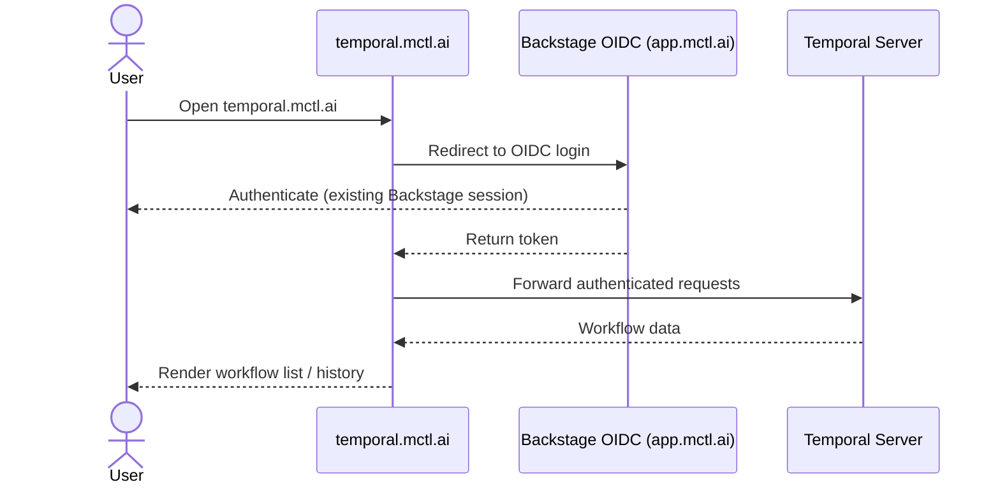
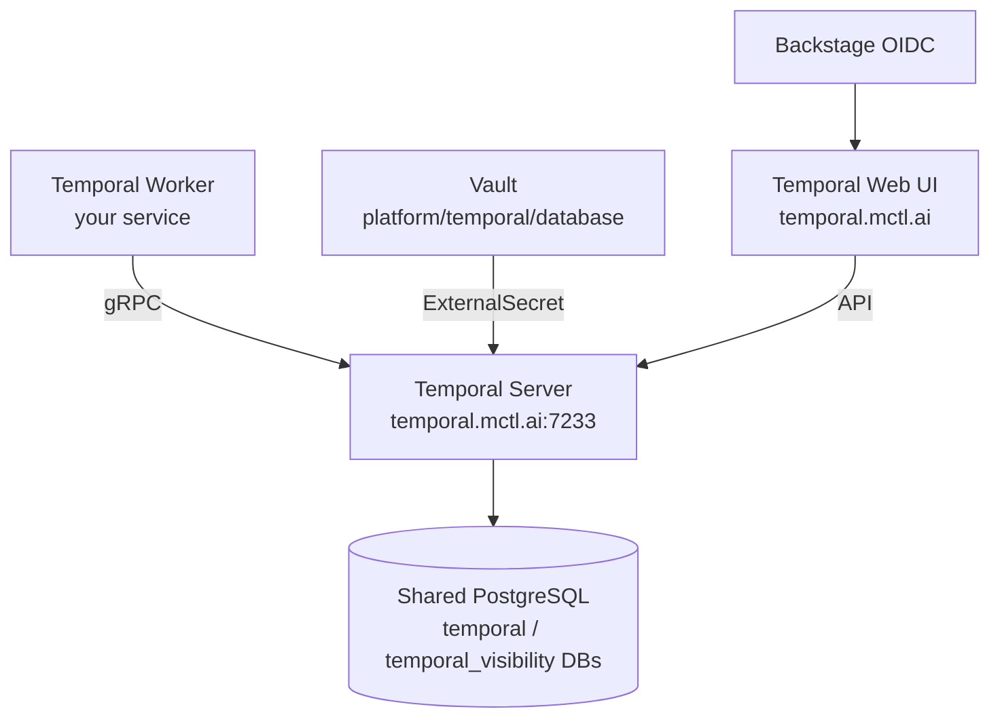

# Proposed content: platform-temporal

> **Apply to:** `mctl-docs/docs/platform/temporal.md` (CREATE)
> **Source:** mctl-gitops@c2066ae

---

```yaml
---
title: Temporal
description: Using the shared Temporal workflow orchestration service on the mctl platform.
---
```

# Temporal

[Temporal](https://temporal.io) is an open-source workflow orchestration platform for
building reliable, fault-tolerant distributed applications. The mctl platform provides
Temporal as a shared service so tenants can schedule and monitor long-running workflows
without operating their own Temporal cluster.

## Web UI

The Temporal Web UI is available at **[temporal.mctl.ai](https://temporal.mctl.ai)**.

Authentication is handled by Backstage OIDC — use the same credentials you use for
[app.mctl.ai](https://app.mctl.ai). No separate Temporal account is required.



## Connecting a Temporal worker

Point your Temporal worker at the shared cluster frontend:

```yaml
# Example: Temporal worker configuration
temporal:
  hostPort: "<TODO: confirm exact gRPC endpoint with author of mctl-gitops@c2066ae>"
  namespace: "<your-tenant-namespace>"
```

> **Note:** The namespace must be pre-registered before your worker can connect.
> See [Getting a namespace](#getting-a-namespace) below.

The server uses **Postgres advanced visibility**, which enables full-text search on
workflow attributes via the Temporal Web UI and `tctl`/SDK query APIs.

## Getting a namespace

Temporal namespace registration is currently a **manual process**. Self-serve
onboarding is not yet available.

To request a namespace for your tenant:

1. Open an issue in [mctlhq/mctl-gitops](https://github.com/mctlhq/mctl-gitops)
   with the title `[temporal] Register namespace: <tenant>/<app-name>`.
2. The platform team will extend the PostSync Job registration script
   (`platform-gitops/infra-components/data/temporal/tenant-namespace-job.yaml`)
   and merge the change.
3. Once the ArgoCD sync completes, your namespace is ready and you can start your
   Temporal workers.

::: tip
The first tenant onboarded was `labs/kuptsi-app` (2026-05-06). If you need an
example of a working Temporal worker deployment on the mctl platform, refer to the
kuptsi-app Helm values in mctl-gitops.
:::

## Architecture



- **Temporal server version:** 1.2.0 (chart) / 1.31.0 (server)
- **Database:** shared `cnpg` PostgreSQL cluster, `temporal` and `temporal_visibility`
  databases, `temporal` role with `scram-sha-256` auth
- **Credentials:** sourced from Vault path `platform/temporal/database` via
  ExternalSecret (namespaces: `platform-db`, `temporal`)

## Limitations

| Limitation | Detail |
|---|---|
| Tenant onboarding | Manual — platform team must extend the registration script |
| Single shared cluster | No per-tenant isolation at the cluster level |
| No self-serve namespace creation | Planned but not yet implemented |

---

> **TODO markers for implementer:**
> - `<TODO: confirm exact gRPC endpoint with author of mctl-gitops@c2066ae>` —
>   replace with the actual Temporal Frontend address (e.g. `temporal.mctl.ai:7233`
>   or an internal cluster DNS name).
> - Verify the kuptsi-app reference is appropriate to leave in the published docs or
>   replace with a more generic example.
